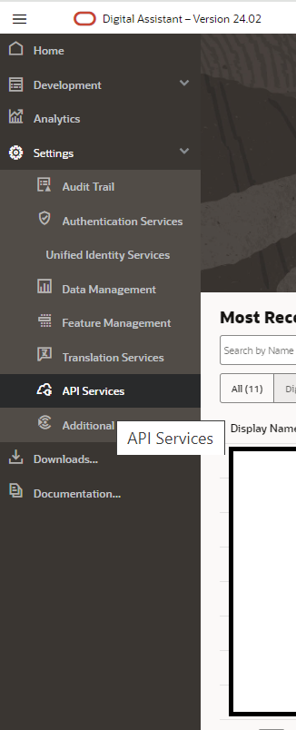
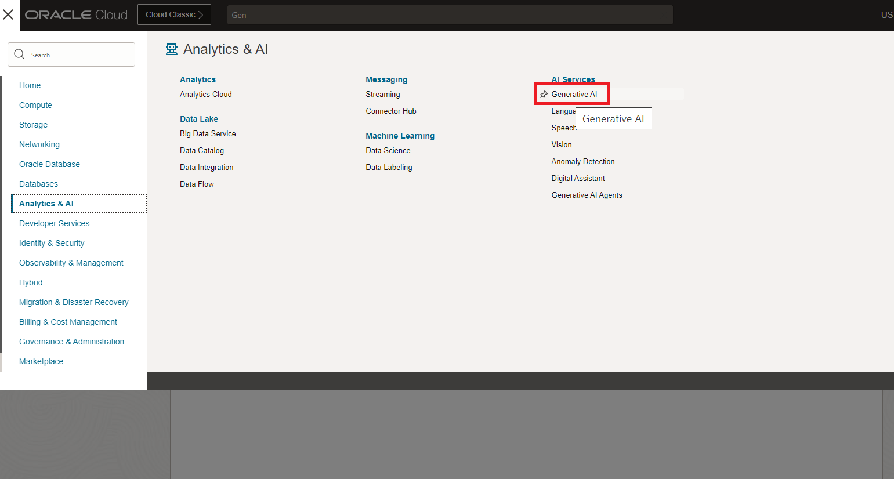
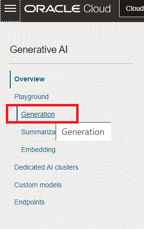
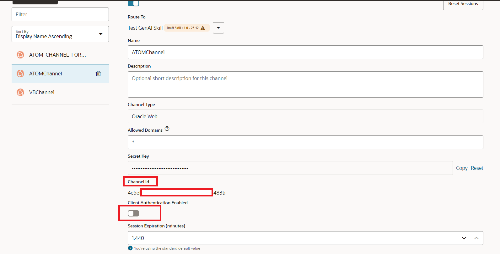

# Provision of Oracle Digital Assistant & Visual Builder Instance

## Introduction

This lab will take you thru the step needed to provision Oracle Digital Assistant & Visual Builder Cloud Service

Estimated Time: 1 hours 30 minutes

### About Oracle Digital Assistant

Oracle Digital Assistant delivers a complete AI platform to create conversational experiences for business applications through text, chat, and voice interfaces

### Objectives

Provisioning of ODA

In this lab, you will:

* **Provision ODA Instance**
  * Follow Task 1 to Task 5 to set-up ODA Instance
* **Provision VBCS Instance**
  * Follow Task 6

### Prerequisites

This lab assumes you have:

* An Oracle account
* Access to the Chicago Region
* Administrator permissions or permissions to use the Generative AI family, the AI services family, Digital Assistant, and Visual Builder

## Task 1: Provision Oracle Digital Assistant

This task will help you to create Oracle Digital Assistant under your choosen compartment.

1. Locate Digital Assistant under AI Services

   

   > **Note:** You can find Digital Assistant under the AI Services.

2. Provide the information for **Compartment**, **Name** , **Description** (optional) & **Shape**. Click **Create**

    

3. In few minutes the status of recently created Digital Assistant will change from **Provisioning** to **Active**

    

## Task 2: Dynamic Group & Policy creation for Oracle Digital Assistant

This task will help you to create desired dynamic group & necessary policy for the Oracle Digital Assistant

1. Attach the policy at the root compartment level

    ```text
    <copy>
    Allow any-user to use ai-service-generative-ai-family in tenancy where request.principal.id='ocid1.odainstance.oc1.us-chicago-1.XXXXXXXXXXXXXXXXXXXXXXXXXX'
    Allow any-user to use generative-ai-family in tenancy where request.principal.id='ocid1.odainstance.oc1.us-chicago-1.XXXXXXXXXXXXXXXXXXXXXX'
    Allow any-user to use fn-invocation in tenancy where request.principal.id='ocid1.odainstance.oc1.us-chicago-1.XXXXXXXXXXXXXXXXXXXX'
    </copy>
    ```

    > **Note:**
    > * Please make sure that the compartmentId should be the one under which the resource is  created.

## Task 3: Create REST Service for the OCI Generative AI Service

This task involves creating REST service which will be used by ODA to connect to OCI Generative AI Service. The REST Service will be created for the ODA created in **Task 1**.

1. Locate the ODA created in **Task 1**

    

2. Select the earlier created ODA Instance and click on **Service Console**

    

3. Click on hamburger menu and locate & click **API Services**

    

4. Click on **Add REST Service**. Provide the following details:
    * **Name** : `Gen_AI_Service`
    * **Endpoint** : `https://inference.generativeai.us-chicago-1.oci.oraclecloud.com/20231130/actions/generateText`
    * **Description (Optional)** : `Optional`
    * **Authentication Type** : OCI Resource Principal
    * **Method** : POST
    * **Request**
    * **Body**

    ```text
    <copy>
    {
        "compartmentId": "ocid1.compartment.oc1..XXXXXXXXXXX",
        "servingMode": {
            "modelId": "ocid1.generativeaimodel.oc1.us-chicago-1.XXXXXXXX",
            "servingType": "ON_DEMAND"
        },
        "inferenceRequest": {
            "prompt": "What is OCAF?",
            "maxTokens": 600,
            "temperature": 1,
            "frequencyPenalty": 0,
            "presencePenalty": 0,
            "topP": 0.75,
            "topK": 0,
            "returnLikelihoods": "GENERATION",
            "isStream": true,
            "stopSequences": [],
            "runtimeType": "COHERE"
        }
    }
    </copy>
    ```

5. This step is broken down into following 3 steps
    * Step 1: Click on hamburger menu of OCI console and select **AI Services** > **Generative AI**

    

    * Step 2: Select Generation (under **Playground** heading)

    

    * Step 3: For the **Model**=**cohere.command.v15.6**, Click **View Model Details**, and then click on **copy** link for the **cohere.command** and **version** = 15.6

    

6. Click **Test Request** to make sure the connection is successful

   

    > **Note**
    > * Retrieve the modelId (OCID) from OCI Gen AI Services Playground and use a compartmentId where the ODA is hosted inside
    > * If you are using a different name (and not Gen_AI_Service) for your Rest service then please make a change in your LLM Provider in Settings as well. To do that Go to Skills -> Settings -> Configuration -> Large Language Model Services -> LLM Provider. Choose the new Rest Service for both GenAI_LLM and  GenAI_Truncate_LLM

    

## Task 4: Import Skill (Provided)

1. Click on the link to download the required skill (zip file): [Atom_Skill_txt.zip](https://objectstorage.us-ashburn-1.oraclecloud.com/p/2ZHprOu2tSai8mJNQQm34NX65oLDcFMs46FiPKlA4cHZD0XJpvIFeycEd2aPMdkm/n/c4u02/b/hosted_workshops/o/ATOM_Skill_txt.zip)

2. Import the skill (downloaded). Click on **Import Skill** & select the zip file to import

   

## Task 5: Create Channel to embed ODA in Visual Builder Application (provided) or in any custom Web App

1. Click on hamburger menu and select Development > Channels

    

2. Select the following option on the form:

    * **Channel Type** = Oracle Web
    * **Allowed Domain** = *

    

3. After channel creation, enable the Channel by using the toggle button (screenshot).
   * Route it to skill imported in Task 4

   

4. Disable the **Client Authentication Enabled** toggle. (Take note of channelId for **Task 6** in later step).

    

## Task 6: Create VBCS Instance & embed ODA skill in VBCS Application (Please directly move to Step 5 incase you already have a VBCS instance provisioned)

1. Click on main hamburger menu on OCI cloud console and navigate Developer Services > Visual Builder

    

2. Create Visual Builder Instance by providing the details and click **Create Visual Builder Instance**:
    * **Name** = <suitable_name>
    * **Compartment** = <same_compartment_as_oda>
    * **Node** = <as_per_need>

    

3. Wait for the instance to come to **Active** (green color) status

4. Click on the link to download the VB application (zip file): [ATOM_VB.zip](https://objectstorage.us-ashburn-1.oraclecloud.com/p/UcaJRNLr-UXQ55zFIOdS_rloRYfUSYA49sRGZsBON3ZNYncODcwC1DLdz7Xw4PJd/n/c4u02/b/hosted_workshops/o/ATOM_VB.zip)

5. Import the application in provisioned instance as per the screenshots

    * Click on Import from Visual Builder Instance

        

    * Choose the option as below

        

    * Provide the App Name with other details and select the provided application zip file

        

6. Once import is completed, open the index.html file in the VB Instance and update the details as follows:

    * **URI** = '<https://oda-XXXXXXXXXXXXXXXXXXXXXX.data.digitalassistant.oci.oraclecloud.com/>'
    * **channelId** = 'XXXXXXXXXXXXXXXXXXXXXXXXXXXX'
    * Please change value of initUserHiddenMessage on Line 32 from 'what can you do' to 'Hello'

    

    > **Note**
    > * URI is the hostname of ODA instance provisioned in **Task 1**
    > * channelId is created during **Task 5** - **Step 3**

7. Click on the Play button shown in the above image on the top right corner to launch ATOM chatbot and start chatting with ATOM.

## Acknowledgements

**Authors**

* **Nitin Jain**, Master Principal Cloud Architect, NACIE
* **Abhinav Jain**, Senior Cloud Engineer, NACIE
