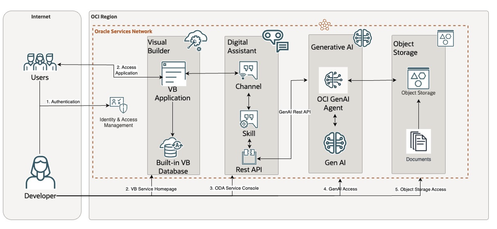

# Introduction

## About this Workshop

Many of you have already been using Generative AI technologies to get or generate information. 

However, if you want to get the information about your company’s private policies (that might be maintained in internal documents), you may not be able to get that correct information, or the Large language Model (LLM) might hallucinate (that is - generates responses that are nonsensical, factually incorrect, or disconnected from the user’s question).

The reason is – in most of the cases, the base LLM (that powers these Generative AI chatbots) have been trained earlier on old public data, so it does not have the knowledge about any restricted information. And re-training the base LLM with new data is a very resource / time consuming process.

We’ll see here how you can develop a solution using OCI Digital Assistant and OCI Generative AI Agents (Beta) services.

This solution enables developers to perform GenAI RAG on custom PDF documents (stored in OCI Object Storage) using the OCI Generative AI Agent Service. 

The users can then
- From OCI Digital Assistant Chatbot (that can be hosted in an OCI Visual Builder Web Application), connect to OCI Generative AI Agent Service (leveraging OCI Functions).
- Get responses of their question (in natural language) from those custom PDF documents.

Estimated Workshop Time: -- hours -- minutes (This estimate is for the entire workshop - it is the sum of the estimates provided for each of the labs included in the workshop.) TODO

*You may add an option video, using this format: *

  

### Objectives

Objective of this workshop is to set-up the required OCI services to create a full Generative AI Agent solution with RAG capabilities:

* OCI Object Storage Service – Users can configure OCI Object Storage and create Buckets.
Users can then upload their own unstructured PDF manuals / documents in those buckets.
* OCI Generative AI Agent (Beta) Service – Users can configure OCI Generative AI Agent (Beta) Service (create and configure Knowledge Bases and Agents).
Users can then ingest and perform RAG on the user’s documents in OCI Object Storage, using OCI Generative AI Agent (Beta) Service.
* OCI Functions – Users can configure OCI Functions, using Python SDK
Users can then connect to OCI Generative AI Agent Service using OCI Functions. The OCI Functions can be exposed as a Rest Service
* OCI Digital Assistant (ODA) – Users can create ODA instance and create an ODA Skill.
Users can then connect from ODA Skill to OCI Generative AI Agent Service, leveraging OCI Functions Rest Service.
* OCI Visual Builder (VB) Application – User can create OCI Visual Builder (VB) instance.
Users can then embed the ODA chatbot in the VB web application. Then the users can get responses from their PDF manuals / documents, using the VB web  application.

In this workshop, you will learn how to:
* Provision an OCI Generative AI Agent
* Provision Infrastructure through Terraform
* Connect OCI Digital Assistant (ODA) to this Agent
* Setup a frontend for ODA with a Visual Builder application
* Test the agent's knowledge base against user queries

### Prerequisites

This lab assumes you have:
* An Oracle Cloud Account
* Enrolled in Beta fo OCI Generative AI Agents for RAG - https://apexadb.oracle.com/ords/f?p=108:501:508002131060566::::P501_SELF_NOMINATION:Self-Nomination
* Access to Region where Agent service is available: Chicago, Frankfurt
* Must have an Administrator Account or Permissions to manage several OCI Services: Generative AI Agents, Digital Assistant, Visual Builder, Object Storage, Functions, Dynamic Groups, Policies, IDCS/Identity Domain Confidential Applications, Resource Manager
* Familiarity with Oracle Cloud Infrastructure (OCI) is helpful

## Learn More

*(optional - include links to docs, white papers, blogs, etc)*

* [URL text 1](http://docs.oracle.com)
* [URL text 2](http://docs.oracle.com)

## Acknowledgements
* **Author** - <Name, Title, Group>
* **Kaushik Kundu**, Master Principal Cloud Architect, NACIE
* **JB Anderson**, Senior Cloud Engineer, NACIE
* **Contributors** -  <Name, Group> -- optional
* **Abhinav Jain**, Senior Cloud Engineer, NACIE
* **Last Updated By/Date** - <Name, Month Year>
