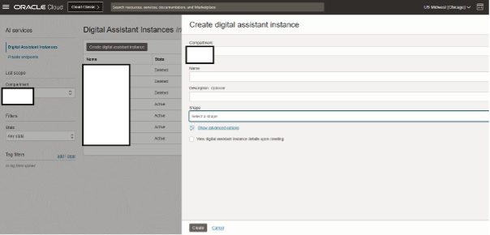
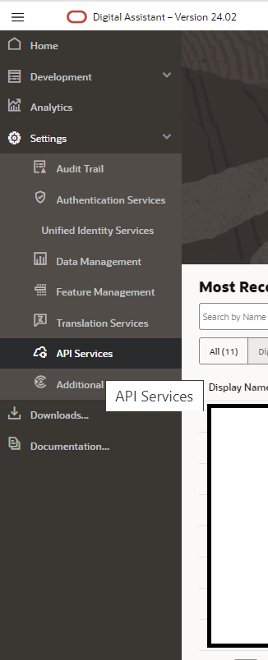
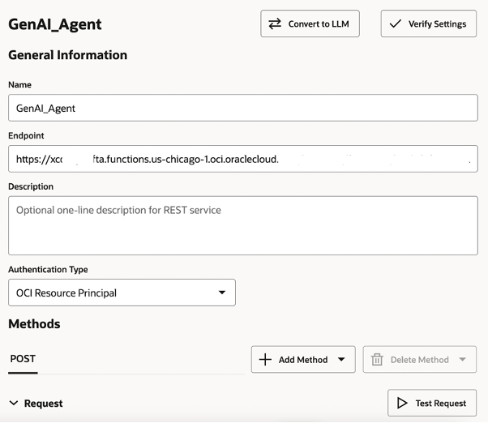
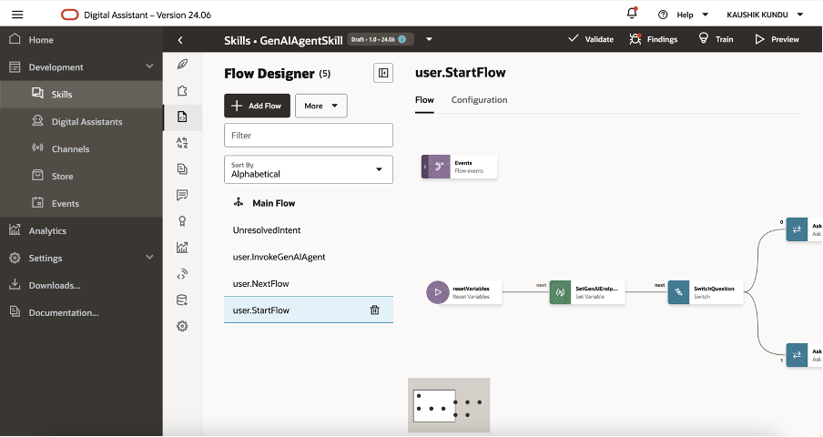
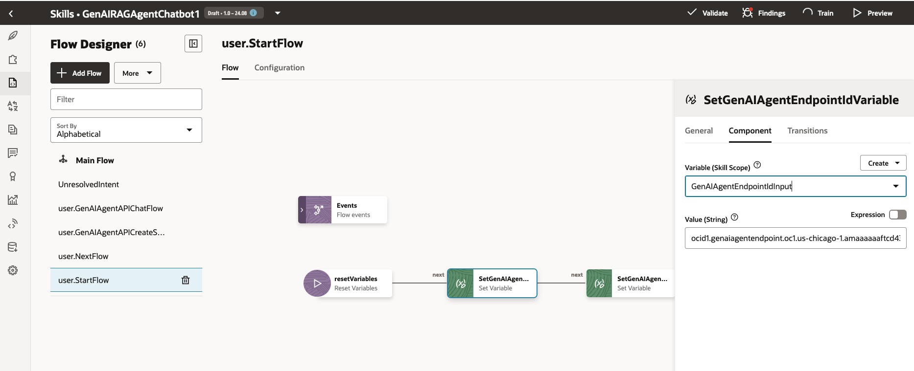
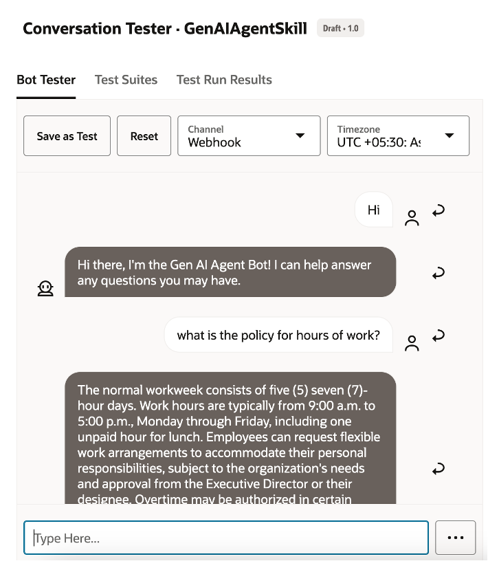
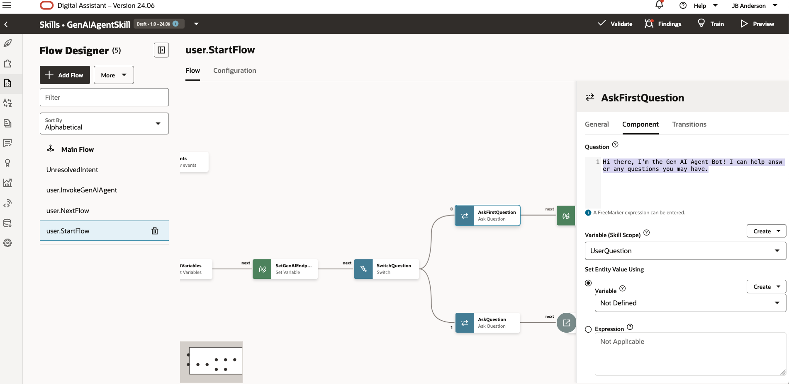
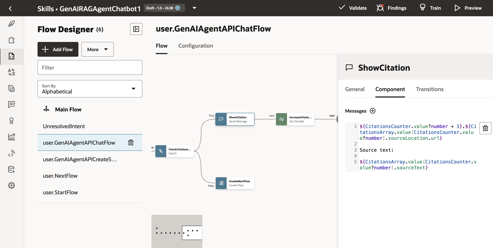

# Setup OCI Digital Assistant (ODA)

## Introduction

This lab will take you through the steps needed to provision Oracle Digital Assistant Cloud Service

Estimated Time: 30 minutes

### About OCI Digital Assistant

Oracle Digital Assistant (ODA) is a platform that allows you to create and deploy digital assistants for your users. Digital assistants are virtual devices that help users accomplish tasks through natural language conversations, without having to seek out and wade through various apps and web sites. Each digital assistant contains a collection of specialized skills. When a user engages with the digital assistant, the digital assistant evaluates the user input and routes the conversation to and from the appropriate skills.

### Objectives

In this lab, you will:

* Provision an ODA instance
* Import and configure a skill to use GenAI Agents
* Create a Channel to connect the skill to a frontend

### Prerequisites

This lab assumes you have:

* All previous labs successfully completed
* Must have an Administrator Account or Permissions to manage several OCI Services: Digital Assistant

## Task 1: Provision Oracle Digital Assistant

This task will help you to create Oracle Digital Assistant under your chosen compartment.

1. Locate Digital Assistant under AI Services

    

    **Note** You can find Digital Assistant under the AI Services.

2. Provide the information for Compartment, Name , Description (optional) & Shape. Click Create

    


3. In few minutes the status of recently created Digital Assistant will change from Provisioning to Active

    

## Task 2: Create a REST Service for the OCI Functions

This task involves creating REST service which will be used by ODA to connect to OCI Functions. The REST Service will be created for the ODA created in Task 1.

1. Locate the ODA created in Task 1

    

2. Select the earlier created ODA Instance and click on Service Console

    

3. Click on hamburger menu and locate & click API Services

    

4. Click on Add REST Service. Provide the following details:

    * Name: `GENAI_AGENT`
    * Endpoint: Use the Functions Endpoint URL that you copied in the previous lab
    * Description: optional
    * Authentication Type: OCI Resource Principal
    * Method: Post
    * Request Body: Update the json payload provided below
        * For the “user_message”, use appropriate question whose answer is in the PDF document that you uploaded earlier to Object Storage Bucket.

    ```
    <copy>{
        "user_message": "what is the XXXXX XXXXX?",
        "endpoint_url": "",
        "endpoint_id": "",
        "delete_session":"",
        "keep_alive_session":"",
        "session_id": "",
    }</copy>
    ```
    <!-- TODO: technically only the user message is required-->

5. Click Test Request to make sure the connection is successful

    

## Task 3: Import Skill (Provided)

1. Click on the link to download the required skill “GenAIAgentSkill(1.0).zip”

    [GenAIAgentSkill(1.0).zip](https://objectstorage.us-chicago-1.oraclecloud.com/p/tHMMKzOvr0k2HCGQ42ksjkEgFEyMoA5OdlUTO_ecdpnEH06Uut1jl9Dl6O0WkblH/n/idb6enfdcxbl/b/generative-ai-agent-oda/o/GenAIAgentSkill(1.0).zip)

2. Import the skill (downloaded). Click on Import Skill & select the zip file to import

    

3. Open the GenAIAgentSkill, go to “Flows” and click on “user.StartFlow”

    

4. Open the second step “SetGenAIEndpointId”, and set the correct OCID Value (the endpoint OCID that you copied in [Lab 1 Task 4 Step 4](../agent/agent.md#task-4-provision-agent)) of GenAIEndpointId variable.

    Then click on the “Preview” button at top-right corner.

    

5. You should be able to successfully the ODA Skill

    **NOTE** to start the conversation loop in ODA preview, send this initial message: "Hi"
    

## Task 4: Create Channel to Embed ODA in Visual Builder Application or in any custom Web App

1. Click on hamburger menu and select Development > Channels

    

2. Select the following option on the form:
    * Channel Type = Oracle Web
    * Allowed Domain = *

    

3. After channel creation, route it to skill imported in Task 3, and enable the Channel by using the toggle button.

    

4. Ensure that the Client Authentication Enabled is disabled. Take note of Channel Id.

    

## Task 5: (optional) Customize ODA Conversation

1. Customize predefined agent messages

    * In the ODA Service Console, click on the appropriate skill
    * In the **Flows** tab, click on user.StartFlow
    * To modify the initial agent message: "Hi there, I'm the Gen AI Agent Bot! I can help answer any questions you may have."
        * update AskFirstQuestion block -> component tab -> question
    * To modify the continuation question: "If you have any other question, you can please ask me."
        * update AskQuestion -> component tab -> question

    

2. Customize citation format
    * In the ODA Service Console, click on the appropriate skill
    * In the **Flows** tab, click on user.InvokeGenAIAgent
    * For the three OutputCitation blocks, update the component tab -> messages

    

## Task 6: (optional) View Conversation Analytics

From ODA service console homepage -> skill **Dislpay name** -> **Insights** on side nav bar

* On this overview page, you can see stats such as **Total number of Conversations** and **Number of Unique users
* The View dropdown on the top right allows you to set a time window
* The Channels filter allows you to filter data from a specific frontend channel
* The Conversations tab allows you to see user messages and the agent's responses
<!-- TODO: add screenshot-->

## Acknowledgements

* **Author**
    * **Kaushik Kundu**, Master Principal Cloud Architect, NACIE
    * **JB Anderson**, Senior Cloud Engineer, NACIE
* **Contributors**
    * **Abhinav Jain**, Senior Cloud Engineer, NACIE
* **Last Updated By/Date**
    * **Kaushik Kundu**, Master Principal Cloud Architect, NACIE, August 2024
