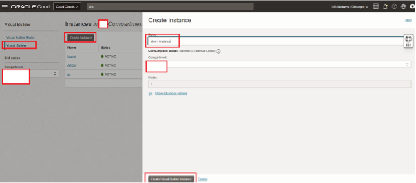
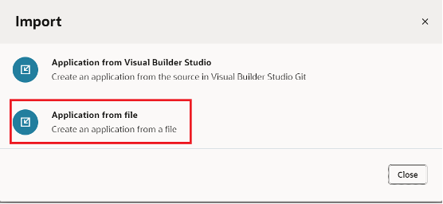

# Provision of Oracle Visual Builder

## Introduction

This lab will take you through the steps needed to provision Oracle Visual Builder (VB)

Estimated Time: -- minutes

### About Visual Builder

Oracle Visual Builder is a cloud-based software development platform and a hosted environment for your application development infrastructure. It provides an open source standards-based solution to develop, collaborate on, and deploy applications within Oracle Cloud.

In this workshop, we are using Visual Builder as the frontend solution end users will interact with. You can substitute this with any [frontend technology](https://docs.oracle.com/en/cloud/paas/digital-assistant/use-chatbot/channels-topic.html) with the ability to embed an ODA channel

### Objectives

In this lab, you will:

* Create a Visual Builder Instance
* Deploy a Visual Builder Application
* Customize the Application to use your ODA skill
* Provide end user access to the Application

### Prerequisites (Optional)

This lab assumes you have:

* All previous labs successfully completed

## Task 1: Create VBCS Instance & embed ODA skill in VBCS Application

1. Click on main hamburger menu on OCI cloud console and navigate Developer Services > Visual Builder

    

2. Create Visual Builder Instance by providing the details and click Create Visual Builder Instance:
    * Name =
    * Compartment =
    * Node =

    

3. Wait for the instance to come to Active (green color) status

4. Click on the link to download the VB application (zip file): ATOM_VB.zip
    [ATOM_VB.zip](https://objectstorage.us-ashburn-1.oraclecloud.com/p/UcaJRNLr-UXQ55zFIOdS_rloRYfUSYA49sRGZsBON3ZNYncODcwC1DLdz7Xw4PJd/n/c4u02/b/hosted_workshops/o/ATOM_VB.zip)

5. Import the application in provisioned instance as per the screenshots. Users only need one VCBS instance created. They can import/create multiple applications in the instance for each additional chatbot they have
    * Click on Import from Visual Builder Instance

    

    * Choose the option as below

    

    * Provide the App Name with other details and select the provided application zip file

    

6. Once import is completed, update the index.html file
    * Click on source in the navigation sidebar
    * filepath: webApps/atom/index.html
    * update the details as follows:
        * URI = 'oda-XXXXXXXXXXXX.data.digitalassistant.oci.oraclecloud.com/'
            * URI is the hostname of the ODA instance provisioned in Task 1 of the previous lab
        * channelId = 'XXXXXXXXXXXXXXXXXXXXXXXXXXXX'
            * o	channelId is created during Task 5 - Step 3 of the previous lab
        * Please set value of initUserHiddenMessage on Line 32 to “Hi” <!--TODO: Why don't we do this in the artifact? Why is sending Hi necessary?-->

    

7. The UI of the chatbot such as theme, color and icon can be changed by modifying the parameters under var chatWidgetSetting from index.html

8. Click on the Play button shown in the above image on the top right corner to launch ATOM chatbot and start chatting with ATOM.

9. (optional) Enable User Access
    * Note the name of your VB App
    * Navigate in the OCI Console to Identity & Security -> Identity -> Domains
    * Click the **Default** domain or whatever domain is tied to your VB instance
    * under **Integrated Applictaions**, search for your VB app's name
        * Each version of your VB app will have a base and test config.
        * Adding a user or group to the latest version's base configuration will give them access to the live version of the app <!-- TODO: I get an error when trying to do either thing: Could not perform the Grant because the entitlement attributeName is null or empty.-->
        <!--TODO: do permissions retain from version to version?-->
    * Note the name of your VB service
    * Under **Oracle Cloud Services**, search for your VB Service name
        * under Application roles add users or groups to the appropriate roles <!-- TODO: what are the appropriate roles-->

<!--TODO: add another task on setting up end users to access VBCS application -->

## Acknowledgements

* **Author**
    * **Kaushik Kundu**, Master Principal Cloud Architect, NACIE
    * **JB Anderson**, Senior Cloud Engineer, NACIE
* **Contributors**
    * **Abhinav Jain**, Senior Cloud Engineer, NACIE
* **Last Updated By/Date**
    * **JB Anderson**, Senior Cloud Engineer, NACIE, August 2024